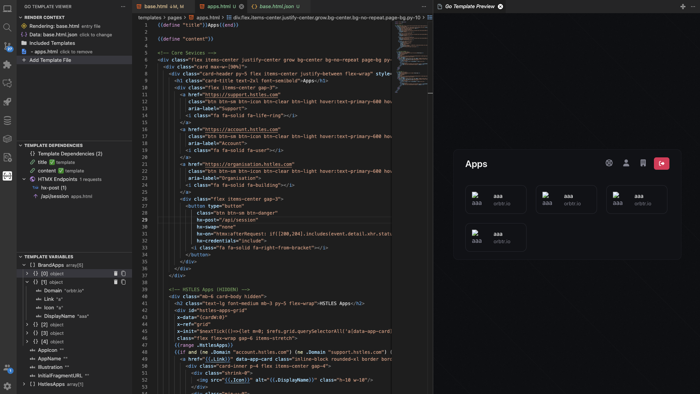

# Go Template Viewer

A Visual Studio Code extension for developing and previewing Go templates with live reload functionality. This extension helps frontend developers and template designers work with Go templates without needing to run the full Go application.



## Features

### 🎯 **Multi-File Render Context**
- Build complex template compositions by adding multiple files
- Render templates with their dependencies (base.html + content.html)
- Visual management of included templates
- See exactly which files are in your render context

### 🔍 **Accurate Go Template Parsing**
- Uses actual Go `html/template` parser via helper CLI
- True Go template syntax understanding (not regex-based)
- Accurate template dependency detection
- Identifies template includes, blocks, and definitions

### 📊 **Smart Variable Tracking**
- Automatically discovers template variables from usage
- Track which file each variable comes from
- Infers data types from context (boolean, array, object, string)
- Inline variable editing with JSON support

### 🎨 **Live Preview with Full Asset Support**
- Real-time rendering using actual Go template engine
- Renders complete HTML output with CSS and JavaScript
- Configurable content root for static assets
- Auto-refresh on template or data changes

### 🔄 **Dependency Management**
- Visual dependency tree showing required templates
- Missing dependencies clearly marked
- Click to add missing template files
- Satisfaction checking based on included files

### 💾 **Fixture Management**
- Save template data as JSON fixtures
- Link data files to specific templates
- Persistent test scenarios across sessions
- Stored in `.vscode/template-data/`

### 🌳 **Dedicated Sidebar Views**
- **Render Context**: Manage entry file, data, and included templates
- **Template Variables**: Edit variable values with source tracking
- **Template Dependencies**: Browse and resolve template dependencies

## Installation

### From VS Code Marketplace
1. Open VS Code
2. Go to Extensions (⌘+Shift+X / Ctrl+Shift+X)
3. Search for "Go Template Viewer"
4. Click Install

### Prerequisites
The extension includes pre-built Go helper binaries for all major platforms (Windows, macOS, Linux). No additional installation required!

## Usage

### Quick Start

1. **Open a Go template file** (`.html`, `.tmpl`, `.tpl`, `.gohtml`)
2. **Click "Change Entry File"** in the Render Context view, or right-click the file and select **"Open Go Template Preview"**
3. **Add template files** to your render context using the **"➕ Add Template File"** button
4. **Edit variables** in the Template Variables view
5. **Watch the live preview** update automatically

### Working with Multi-File Templates

For templates that use `{{template}}` or `{{block}}`:

1. **Select your base template** (e.g., `base.html`) as the entry file
2. **Add content templates** using the "➕ Add Template File" button
3. The preview will render with all included files
4. Dependencies view shows which templates are satisfied ✅ or missing ❌

**Example:**
```
base.html contains: {{template "content" .}}
auth.html contains: {{define "content"}}...{{end}}

1. Set base.html as entry file
2. Add auth.html to render context
3. Preview shows the combined result
```

### Managing Template Data

**Edit inline:**
- Click any variable in the Template Variables view
- Enter simple values or JSON objects/arrays
- Data auto-saves to `.vscode/template-data/`

**Link data files:**
- Click "📄 Data: (none)" in Render Context view
- Select a `.json` file with your test data
- Data persists across sessions

### Example Template

```html
<!DOCTYPE html>
<html>
<head>
    <title>{{.Title}}</title>
</head>
<body>
    {{template "header" .}}
    
    <h1>Welcome, {{.User.Name}}!</h1>
    
    {{if .ShowProjects}}
    <ul>
        {{range .Projects}}
        <li>{{.Name}} - {{.Description}}</li>
        {{end}}
    </ul>
    {{end}}
</body>
</html>
```

### Example Data

```json
{
  "Title": "My Dashboard",
  "User": {
    "Name": "John Doe"
  },
  "ShowProjects": true,
  "Projects": [
    {
      "Name": "Website",
      "Description": "Company website"
    }
  ]
}
```

## Configuration

### Content Root

If your Go application serves static files from a specific directory:

```json
{
  "goTemplateViewer.contentRoot": "static"
}
```

This ensures CSS, JavaScript, and images load correctly in the preview.

## Supported Template Syntax

- **Variables**: `{{.FieldName}}`, `{{.Object.Property}}`
- **Range**: `{{range .Items}}...{{end}}`
- **Conditionals**: `{{if .Condition}}...{{else}}...{{end}}`
- **With**: `{{with .Data}}...{{end}}`
- **Templates**: `{{template "name" .}}`
- **Blocks**: `{{block "name" .}}...{{end}}`
- **Define**: `{{define "name"}}...{{end}}`

## Extension Commands

- **Go Template Viewer: Change Entry File** - Select the main template to render
- **Go Template Viewer: Add Template File** - Add a template to the render context
- **Go Template Viewer: Open Preview** - Open template preview panel
- **Go Template Viewer: Refresh Preview** - Refresh current preview
- **Go Template Viewer: Link Data File** - Link a JSON data file to the current template

## File Types Supported

- `.html` - HTML templates with Go template syntax
- `.tmpl` - Go template files
- `.tpl` - Template files
- `.gohtml` - Go HTML templates

## Requirements

- Visual Studio Code 1.105.0 or higher

## Known Issues

- Complex custom template functions require data fixtures
- Some edge cases in template parsing may not be fully supported

## Contributing

Contributions are welcome! Please feel free to submit a Pull Request.

1. Fork the repository
2. Create a feature branch (`git checkout -b feature/amazing-feature`)
3. Commit your changes (`git commit -m 'Add amazing feature'`)
4. Push to the branch (`git push origin feature/amazing-feature`)
5. Open a Pull Request

## Development Setup

```bash
# Clone the repository
git clone https://github.com/bbmumford/go-template-viewer.git
cd go-template-viewer

# Install dependencies
npm install

# Build the Go helper
cd go-helper

# On macOS/Linux:
go build -o ../bin/template-helper

# On Windows:
go build -o ../bin/template-helper.exe

cd ..

# Compile and watch
npm run watch

# Press F5 to launch Extension Development Host
```

## Platform Support

This extension works on:
- ✅ macOS (Intel & Apple Silicon)
- ✅ Windows (x64, x86, ARM64)
- ✅ Linux (x64, ARM64)

The extension automatically detects your platform and uses the correct binary.

## License

MIT License - see the [LICENSE](LICENSE) file for details.

## Support

- 🐛 [Report Issues](https://github.com/bbmumford/go-template-viewer/issues)
- 💡 [Request Features](https://github.com/bbmumford/go-template-viewer/issues/new)
- 📖 [Documentation](https://github.com/bbmumford/go-template-viewer)

## Acknowledgments

Built with:
- Go `html/template` and `text/template/parse` packages
- VS Code Extension API
- TypeScript

---

**Enjoy building with Go templates!** 🚀
